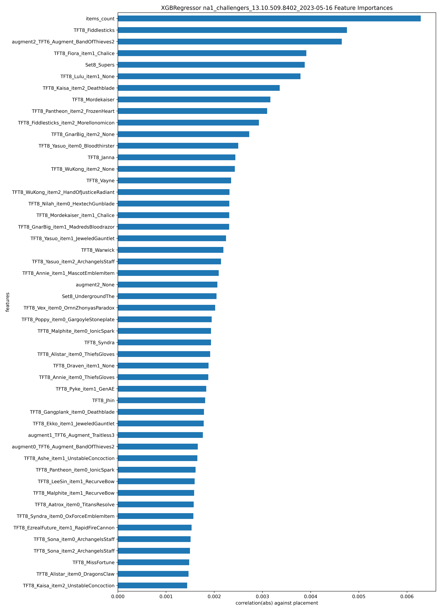
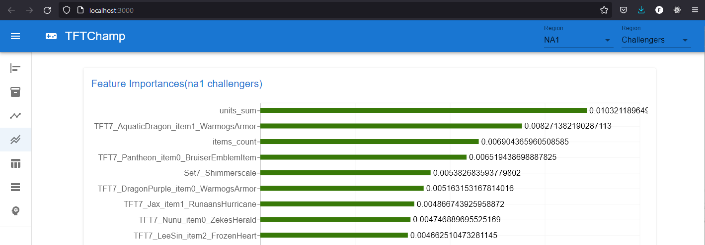
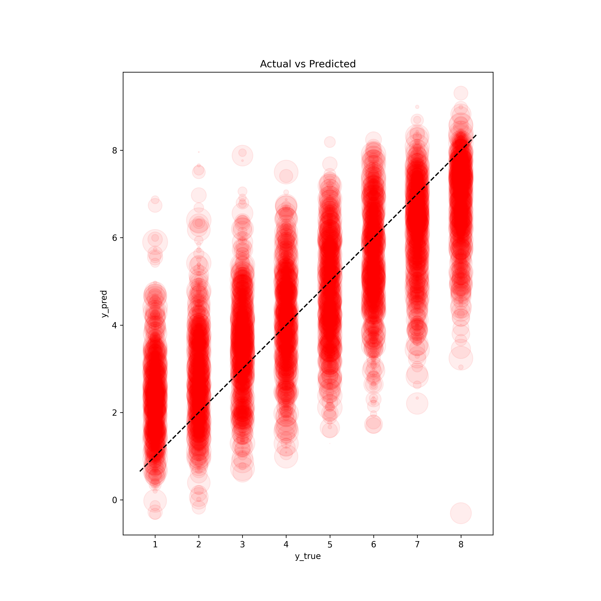

(https://www.python.org/downloads/release/python-3100/)

# Team Fight Tactics Strategy Application

http://tftchamp.duckdns.org:3000/

## Datasets
publish @ https://www.kaggle.com/datasets/teckmengwong/team-fight-tactics-matches


 <!--  -->
 
## Requirements

1. To develop and use this code, you will need:

- a Riot Games Developer account at <https://developer.riotgames.com/>
- a Riot Games API key
- a mongodb services

2. Create and store in tftchamp/.env (user environment in Windows will overwrite)

`RIOT_API_KEY` for Riot API key. `ATLAS_URI` for mongodb connect uri. `DB_NAME` default db.
```
ATLAS_URI=mongodb+srv://<username>:<password>@sandbox.lqlql.mongodb.net/?retryWrites=true&w=majority
DB_NAME=tftchamp
RIOT_API_KEY="RGAPI-blah-blah-blah"
```

3. DEV env

- Python >= `3.10`
- Packages included in `requirements.txt` file
- (Anaconda for easy installation)

### Python virtual env setup
For local setup, I recommend to use [Miniconda](https://docs.conda.io/en/latest/miniconda.html), a minimal version of the popular [Anaconda](https://www.anaconda.com/) distribution that contains only the package manager `conda` and Python. Follow the installation instructions on the [Miniconda Homepage](https://docs.conda.io/en/latest/miniconda.html).

After installation of Anaconda/Miniconda, run the following command(s) from the project directory:

### Install dependencies
Conda virtual environment:
```sh
conda create --name myenv python=3.10
conda activate myenv
conda install --file requirements.txt -c conda-forge
```

As **Conda has limited package support for python 3.10** activate your virtual environment **then** install the dependencies using

```sh
pip install -r requirements.txt
```

## Usage for Jupyter Notebook
Activate and install the correct python3 virtual environment before proceeding.

```sh
jupyter notebook
```

# Datasets
## About this dataset
Team Fight Tactics highest ELO challengers games scrape by https://github.com/furyhawk/tftchamp.
Using https://developer.riotgames.com/ API.

8 players FFA in one game.

**Target Label**: *placement*
1 is best. Lower is better.
Top 4 placement is a Win.
Alternative prediction is to group Top 4 placement as Binary Win, bottom 4 as Binary Lost.

Only team traits and augments/items chosen included in datasets.
Stats like game_length, players_eliminated are excluded. This is to prevent the model from learning obvious predictor.

## Challenges:

- Different baseline between games(match_id). Different games has different baseline at different ELO. This may affect the true value of Global placement.
- Categorical values.

```
## Example
{'match_id': 'EUW1_5944909932', #Match id.
 'placement': 2, # target_label.

# max 3 augments player can choose at stage 2-2, 3-2, 4-2.
 'augment0': 'TFT6_Augment_TrueTwos',
 'augment1': 'TFT6_Augment_CyberneticImplants2',
 'augment2': 'TFT6_Augment_SecondWind2',

# traits
 'Set7_Assassin': 1,
 'Set7_Bruiser': 1,
 'Set7_Cavalier': 2,
 'Set7_Dragonmancer': 0,
 'Set7_Guild': 3,
 'Set7_Legend': 0,
 'Set7_Mirage': 0,
 'Set7_Ragewing': 1,
 'Set7_Swiftshot': 1,
 'Set7_Tempest': 1,
 'Set7_Warrior': 1,

# units/items
 'TFT7_Sejuani': 2,
 'TFT7_Qiyana': 2,
 'TFT7_Shen': 2,
 'TFT7_Shen_item0': 'TFT_Item_ChainVest',
 'TFT7_Shen_item1': 'TFT_Item_Shroud',
 'TFT7_Twitch': 2,
 'TFT7_Twitch_item0': 'TFT_Item_MadredsBloodrazor',
 'TFT7_Hecarim': 2,
 'TFT7_Talon': 2,
 'TFT7_Talon_item0': 'TFT_Item_RedBuff',
 'TFT7_Talon_item1': 'TFT_Item_InfinityEdge',
 'TFT7_Talon_item2': 'TFT7_Item_CavalierEmblemItem',
 'TFT7_Xayah': 2,
 'TFT7_Xayah_item0': 'TFT_Item_GuardianAngel',
 'TFT7_Xayah_item1': 'TFT_Item_InfinityEdge',
 'TFT7_Xayah_item2': 'TFT_Item_GuinsoosRageblade',
 'TFT7_Ornn': 2,
 'TFT7_Ornn_item0': 'TFT_Item_GiantsBelt',
 'TFT7_Ornn_item1': 'TFT_Item_Shroud',
 'TFT7_Yasuo': 1,
 'TFT7_Yasuo_item0': 'TFT_Item_RapidFireCannon',
 'TFT7_Yasuo_item1': 'TFT_Item_MadredsBloodrazor',
 'TFT7_Yasuo_item2': 'TFT_Item_TitansResolve'
}

**MetadataDto**
Name 	Data Type 	Description
data_version 	string 	Match data version.
match_id 	string 	Match id.
participants 	List[string] 	A list of participant PUUIDs.

**InfoDto**
Name 	Data Type 	Description
game_datetime 	long 	Unix timestamp.
game_length 	float 	Game length in seconds.
game_variation 	string 	Game variation key. Game variations documented in TFT static data.
game_version 	string 	Game client version.
participants 	List[ParticipantDto] 	
queue_id 	int 	Please refer to the League of Legends documentation.
tft_set_number 	int 	Teamfight Tactics set number.

**ParticipantDto**
Name 	Data Type 	Description
companion 	CompanionDto 	Participant's companion.
gold_left 	int 	Gold left after participant was eliminated.
last_round 	int 	The round the participant was eliminated in. Note: If the player was eliminated in stage 2-1 their last_round would be 5.
level 	int 	Participant Little Legend level. Note: This is not the number of active units.
placement 	int 	Participant placement upon elimination.
players_eliminated 	int 	Number of players the participant eliminated.
puuid 	string 	
time_eliminated 	float 	The number of seconds before the participant was eliminated.
total_damage_to_players 	int 	Damage the participant dealt to other players.
traits 	List[TraitDto] 	A complete list of traits for the participant's active units.
units 	List[UnitDto] 	A list of active units for the participant.

**TraitDto**
Name 	Data Type 	Description
name 	string 	Trait name.
num_units 	int 	Number of units with this trait.
style 	int 	Current style for this trait. (0 = No style, 1 = Bronze, 2 = Silver, 3 = Gold, 4 = Chromatic)
tier_current 	int 	Current active tier for the trait.
tier_total 	int 	Total tiers for the trait.

**UnitDto**
Name 	Data Type 	Description
items 	List[int] 	A list of the unit's items. Please refer to the Teamfight Tactics documentation for item ids.
character_id 	string 	This field was introduced in patch 9.22 with data_version 2.
chosen 	string 	If a unit is chosen as part of the Fates set mechanic, the chosen trait will be indicated by this field. Otherwise this field is excluded from the response.
name 	string 	Unit name. This field is often left blank.
rarity 	int 	Unit rarity. This doesn't equate to the unit cost.
tier 	int 	Unit tier. 
```

# Database services ./tftchamp/backend/mongodb/

Set your [Atlas URI connection string](https://docs.atlas.mongodb.com/getting-started/) as a parameter in `.env`. Replace <username> and <password> with your credentials.
Create and store in tftchamp/backend/mongodb/.env
```
ATLAS_URI=mongodb+srv://<username>:<password>@sandbox.lqlql.mongodb.net/?retryWrites=true&w=majority
DB_NAME=tftchamp
```

## Localhost mongodb
Or local hosting using docker-compose file @ backend/mongodb/docker-compose.yml

etc. create .env ./tftchamp/backend/mongodb/
```
MONGO_ROOT_USER=admin
MONGO_ROOT_PASSWORD=1234
MONGODB_DATABASE=tftchamp
MONGODB_LOCAL_PORT=27017
MONGODB_DOCKER_PORT=27017
MONGOEXPRESS_LOGIN=user
MONGOEXPRESS_PASSWORD=1234
MONGOEXPRESS_LOCAL_PORT=8888
MONGOEXPRESS_DOCKER_PORT=8081
```

to start the service
```sh
cd backend/mongodb
docker-compose up -d
```

## Application service WIP @ ./tftchamp/backend/app/
We'll use the python-dotenv package to load environment variables ATLAS_URI and DB_NAME from the .env file. Then, we'll use the pymongo package to connect to the Atlas cluster when the application starts. We'll add another event handler to close the connection when the application stops.

Create and store in ./tftchamp/backend/app/.env
.env
```
ATLAS_URI=mongodb+srv://<username>:<password>@sandbox.lqlql.mongodb.net/?retryWrites=true&w=majority
DB_NAME=tftchamp
RIOT_API_KEY="RGAPI-blah-blah-blah"
PATCH=2023-05-16
LATEST_RELEASE=13.10.509.8402
```

```sh
uvicorn main:app --host 0.0.0.0 --port 8000
# python3 -m uvicorn main:app --reload
```

When the application starts, navigate to `http://localhost:8000/docs` and try out the `match` endpoints.

# Machine Learning Pipeline ./tftchamp/backend/pipeline/

Create and store in ./tftchamp/backend/pipeline/.env
.env
```
ATLAS_URI=mongodb+srv://<username>:<password>@sandbox.lqlql.mongodb.net/?retryWrites=true&w=majority
DB_NAME=tftchamp
RIOT_API_KEY="RGAPI-blah-blah-blah"
PATCH=2023-05-16
LATEST_RELEASE=13.10.509.8402
```

1. scrape
2. data_loading
3. team_composition
~4. data_analysis.ipynb~
5. optimizer.py
6. Prediction service TODO

```sh
cd backend/pipeline
python3 scrape_db.py -c configs/challengers.json --no-load_new
python3 scrape_db.py -c configs/challenger_oce.json --no-load_new
python3 scrape_db.py -c configs/grandmasters.json --no-load_new
python3 data_loading_db.py -c configs/challengers_loading.json
python3 data_loading_db.py -c configs/grandmasters.json
python3 team_composition_db.py -c configs/challengers_loading.json
python3 team_composition_db.py -c configs/grandmasters.json
python3 optimizer.py -c configs/config_tft.json
```
windows scripts
```
scripts/run_new.bat
scripts/run_refresh.bat
scripts/run_preprocess.bat
```
linux/macOS scripts
```sh
# or for grandmaster and above league only
bash scripts/run_pipeline.sh [-h] [-nri] [-mgc] [-a] -- Team Fight Tactic pipeline helper

where:
    -h  show this help text
    -n  Scraping for new summoners (default=0)
    -r  Scraping for new matches (default=1)
    -i  Transforming and infering matches (default=0)
    -m  run above for master league (default=0)
    -g  run above for grandmaster league (default=0)
    -c  run above for challenger league (default=1)
    -a  run all above (default=0)
```

## Config file format
Configure the config files under backend/pipeline/configs folder.
Config files are in `.json` format. Example of such config is shown below:
```javascript
{
    "name": "Classification",   // session name

    "model": {
        "type": "Model",    // model name
        "args": {           // args to be pass to class init
            "pipeline": ["scaler", "PLS", "pf", "SVC"],     // pipeline of methods
            "unions": {     // unions of methods included in pipeline
            }
        }
    },

    "tuned_parameters":[{   // hyperparameters to be tuned with search method
                        "SVC__kernel": ["rbf"],
                        "SVC__gamma": [1e-5, 1e-6, 1],
                        "SVC__C": [1, 100, 1000],
                        "PLS__n_components": [1,2,3]
                    }],

    "optimizer": "OptimizerClassification",    // name of optimizer

    "search_method":{
        "type": "GridSearchCV",    // method used to search through parameters
        "args": {                  // args to be pass to class init
            "refit": false,
            "n_jobs": -1,
            "verbose": 2,
            "error_score": 0
        }
    },

    "cross_validation": {
        "type": "RepeatedStratifiedKFold",     // type of cross-validation used
        "args": {                              // args to be pass to class init
            "n_splits": 5,
            "n_repeats": 10,
            "random_state": 1
        }
    },

    "data_loader": {
        "type": "Classification",      // name of dataloader class
        "args":{                       // args to be pass to class init
            "data_path": "../data/noshow.db",    // path to data
            "shuffle": true,    // if data shuffled before optimization
            "test_split": 0.2,  // use split method for model testing
            "stratify": true,   // if data stratified before optimization
            "random_state":1    // random state for repeated output
        }
    },

    "label_name": "no_show",       // specify the label column name
    "score": "max recall",     // mode(max min) and metrics used for scoring - https://scikit-learn.org/stable/modules/model_evaluation.html#scoring-parameter
    "train_model": true,    // if model is training
    "test_model": true,     // if model is tested after training
    "debug": false,         // debug model architecture
    "save_dir": "saved/",   // directory of saved reports, models and configs
    "model_dir": "saved/Classification/0115_140140"         // directory to load saved model. Leave empty "" to auto load current training model.
}

```
## Scraping script ./tftchamp/backend/pipeline/scrape.py

For scrape->data_loading->team_composition `challengers.json` is used.
```javascript
{
    "name": "challengers",              // config folder to creat under `save_dir`
    "load_new": true,                   // scrape, whether to fetch new summoners
    "servers": ["na1", "euw1", "kr"],   // regions to `scrape`, `load`, `process` ['euw1', 'na1', 'kr', 'oc1']
    "league":  "challengers",           // league to `scrape`, `load`, `process` 'challengers', 'grandmasters'
    "max_count": 30,                    // max matches per `scrape`
    "latest_release": "12.14.455.6722", // game version for cutoff '12.12.450.4196' '12.13.453.3037' Version 12.12.448.6653 12.11.446.9344 Version 12.13.453.3037
    "ranked_id": 1100,                  // `1090` normal game `1100` ranked game
    "patch": "2022-07-27",              // patches released date(2022, 7, 1) date(2022, 7, 16)
    "debug": false,                     // not used
    "save_dir": "saved/"                // `process stage`: output to
}
```

To run with custom arg --no-load_new:
```bash
cd backend/pipeline
python3 scrape_db.py -c configs/challengers.json --no-load_new
```

## Front End REACT app ./tftchamp/frontend

DEV test

```sh
npm install # once only
npm start
```

Production LIVE
```sh
docker-compose up
```



# Credits
Riot API discord https://discord.gg/riotgamesdevrel

https://www.mongodb.com/atlas/database

<a href="https://www.flaticon.com/free-icons/mandu" title="mandu icons">Mandu icons created by Freepik - Flaticon</a>
<a href="https://www.flaticon.com/free-icons/tribal" title="tribal icons">Tribal icons created by Freepik - Flaticon</a>
<a href="https://www.flaticon.com/free-icons/electronic" title="electronic icons">Electronic icons created by Freepik - Flaticon</a>
<a href="https://www.flaticon.com/free-icons/brain" title="brain icons">Brain icons created by Freepik - Flaticon</a>
<a href="https://www.flaticon.com/free-icons/code" title="code icons">Code icons created by Freepik - Flaticon</a>
<a href="https://www.flaticon.com/free-icons/artificial-intelligence" title="artificial intelligence icons">Artificial intelligence icons created by Freepik - Flaticon</a>
<a href="https://www.flaticon.com/free-icons/healthcare-and-medical" title="healthcare and medical icons">Healthcare and medical icons created by Freepik - Flaticon</a>
<a href="https://www.flaticon.com/free-icons/games" title="games icons">Games icons created by Freepik - Flaticon</a>
<a href="https://www.flaticon.com/free-icons/fire" title="fire icons">Fire icons created by Freepik - Flaticon</a>
<a href="https://www.flaticon.com/free-icons/unicorn" title="unicorn icons">Unicorn icons created by Freepik - Flaticon</a>


## Recent rankings
2023-05-16 v12.19

### top5_items

### kmeans_comp_ranking13.10.509.8402_2023-05-16

### dbscan_comp_ranking

### augments_stage2-1_ranking

### augments_stage3-2_ranking

### augments_stage4-2_ranking


